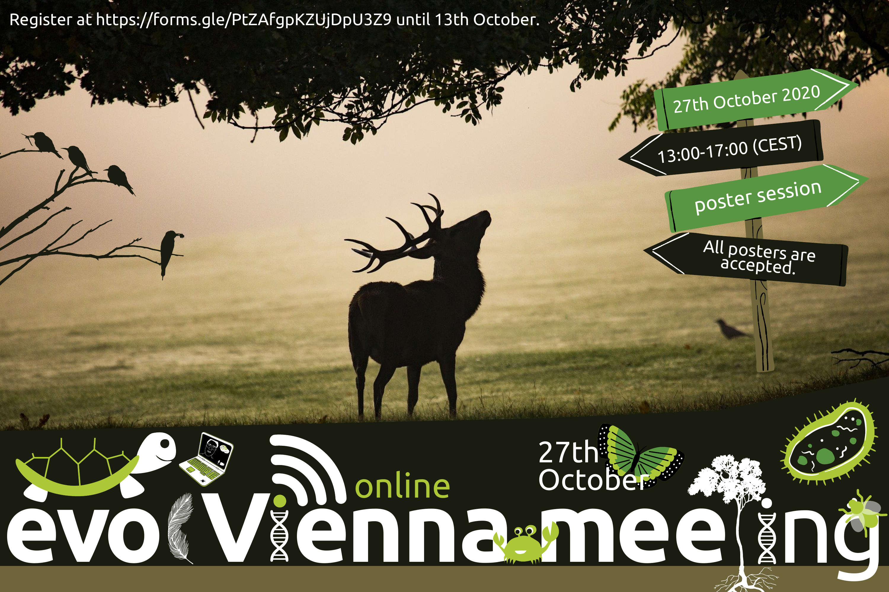

# Welcome to the event page of the next evolVienna meeting on 27th October!

[Schedule](#schedule) | [Sign-up](#sign-up) | [Posters](#poster-session) | [Support & contact](#support-and-contact) | [Tutorial 1](#tutorial-1) | [Tutorial 2](#tutorial-2) | [Tutorial 3](#tutorial-3)

<!--  -->

Due to COVID-19, this [evolVienna](https://www.evolvienna.at/) meeting will take place __online__. We will use the video conferencing system [Zoom](https://zoom.us/) - __no__ paid account is required. We will have __six__ interesting [speakers](#schedule) and we are delighted to announce that this meeting will also include an online [poster session](#poster-session)!

> Registration for this event closes at 13th October.

Please make sure that you are able to enter Zoom meetings using a __Meeting ID__ (not an invite link).

## Schedule

The meeting will take place __online__ on Tuesday, 27th October, 2020, between 13:00 and 17:00 (CEST).

All talks besides the poster session will take place in the same Zoom meeting room (__main room__) provided by _IST Austria_. We will send the details of the meeting room and password closer to the date.

After the first block of talks (14:40), you can leave the _main room_ in order to visit different _poster rooms_ during the poster session (14:45-15:25). Please make sure that you arrive back in the _main room_ before the second block of talks starts (15:30).

The following schedule is preliminary:

Start time (CEST) | End time (CEST) | Presenter               | Title                          | Zoom _Meeting ID_
:----------|:---------|:------------------------|:-------------------------------|:---------
13:00 | 13:10 | Organizing committee | Introduction | TBA
13:10 | 13:40 | Andreas Bergthaler (CeMM Vienna) | _Hidden tales about intra-host diversity, transmission bottlenecks and super-spreading events in the SARS-CoV-2 genome_ | TBA
13:40 | 14:10 | Tal Dahan (GMI & Weizman Institute; presentation by Tom Ellis) | _Resilience of a wild wheat population structure over 36 years of collection_ | TBA
14:10 | 14:40 | Nayuta Yamashita (University of Veterinary Medicine Vienna)| TBA | TBA
14:45 | 15:25 | Break and [poster session](#poster-session) |    |    
15:30 | 16:00 | Sonya Widen (IMBA Vienna) | _Selfish toxin-antidote elements in animals: discovery, mechanisms and implications for speciation_ | TBA
16:00 | 16:30 | Sheng-Kai Hsu (University of Veterinary Medicine Vienna) | _Evolution of reproductive isolation during adaptation in allopatric populations with shared ancestry_ | TBA
16:30 | 17:00 | Reka Kelemen (IST Austria) | _Evolutionary and functional genomics of the t-haplotype, a model meiotic driver_ | TBA

## Sign-up

Please sign-up [here](https://forms.gle/PtZAfgpKZUjDpU3Z9) if you are planning to attend the meeting as __audience__.

If you want to present a __poster__ please sign-up [here](https://forms.gle/octdQ5fc9dj52EuC7).

Both registrations __close at October 13th__. Shortly after this day, the _audience_ and _poster presenters_ will receive the remaining necessary information via email from one of the members of the organizing committee.

## Poster session

The idea is that presenters upload their poster to figshare, and links to each poster will be posted here. Each presenter will host a (free, 40-minute) Zoom meeting where they can discuss it, and the audience can freely enter and leave meetings as they please. Since we are not limited by physical space, we can __accept all poster submissions__, so we encourage as many folks as possible to present.

We will send detailled instructions about setting up figshare and your Zoom meeting after registration has closed on 13th October by email. The Zoom discussions will be private to people who have registered for the meeting. However, please be aware that posters shared on figshare will be public. If you do not want your poster to be published online, please contact Ben Wölfl (benjamin.woelfl@univie.ac.at). 

The two posters below are just __examples__ from [figshare](https://figshare.com) to show how actual poster will be presented once submitted to us, such that you get acquainted with it. Those example poster presentations currently shown below will of course __not__ take place. The Zoom rooms indicated by the Zoom _Meeting IDs_ below will only be active on October 27th between __14:45 and 15:25__ (CEST). The required password for all rooms is the same and will be sent out via email to all attendees.

> __Important:__ As soon as the first poster submission is finalized, the example posters will be removed and you will see a gradual accumulation of the actual posters here.

---

#### Poster 01 (example): _Kamera lens_ thrives in metallic enclosing

Authors: __Jane Smith__1, Max Mustermann2

Affiliations: 1 Imaginary Institute, 2 Imaginary University

Zoom _Meeting ID_: TBA

We studied the lifecycle of _Kamera lens_ and found out that its components derive from recycled conspecifics. We show that the organism's metabolic rate increases 10-fold when being incased in a metallic superstructure. Our insights hint towards a life cycle change from inhabiting plastic towards metallic superstructures during recent evolution. Ultimately, we show this based on recent genetic changes.

> This presenter decided not to share her poster.
  
#### Poster 02 (example): On the recent evolution of _Spongiforma squarepantsi_

Authors: __Joe Smith__1

Affiliations: 1 Imaginary Institute

Zoom _Meeting ID_: TBA

We studied _Spongiforma squarepantsii_ in its natural habitat _Ananas comosus_. Our findings show that a specific plankton species is in a parasitic relationship with _S. squarepantsii_ which is supressed upon symbiosis with _Fromia monilis_. Our findings are supported by genetic evidence.

<iframe src="https://widgets.figshare.com/articles/9641909/embed?show_title=true" width="100%" height="250px" allowfullscreen="true" frameborder="0"></iframe>

---

## Tutorials

---

### Tutorial 1

> How to __access__ a Zoom meeting as __audience__

Click [here](tutorial_zoom_attendee.pdf) to download the PDF with the tutorial.

---

### Tutorial 2

> How to __schedule and open__ a Zoom meeting as a __poster presenter__

Click [here](tutorial_zoom_presenter.pdf) to download the PDF with the tutorial.

---

### Tutorial 3

> How to __publish__ your poster on __figshare__

Click [here](tutorial_figshare.pdf) to download the PDF with the tutorial.

__Reminder:__ If you follow this procedure you are effectively __publishing__ your poster. If you do not like that, please contact a member of the organizing committee.

---

### Support and contact

In case you have any questions or feedback please contact a member of the _evolVienna meeting organizing committee_:
- Benjamin Wölfl (Maths dept - benjamin.woelfl@univie.ac.at)
- Tom Ellis (GMI - thomas.ellis@gmi.oeaw.ac.at)
- Christina Hedderich (Botany dept - christina.hedderich@univie.ac.at)
- Sanjay Narayanaswamy (Althanstraße, Uni Wien - sathyasaisanjay@gmail.com)
- Daria Shipilina (IST - daria.shipilina@ist.ac.at)

### Author and acknowledgements

Author: Benjamin Wölfl, Department of Mathematics, Oskar-Morgenstern-Platz 1, 1090 Wien, Austria

Big thanks to the _evolVienna_ community for support, attending, talks, poster submissions and lively discussions.

An image by <a href="https://pixabay.com/users/dianaparkhouse-9868127/?utm_source=link-attribution&amp;utm_medium=referral&amp;utm_campaign=image&amp;utm_content=4551691">Diana Parkhouse</a> from <a href="https://pixabay.com/?utm_source=link-attribution&amp;utm_medium=referral&amp;utm_campaign=image&amp;utm_content=4551691">Pixabay</a> was used on this website. Other images are derived from <a href="https://www.canva.com/">Canva</a> on a _free for noncommerial use_ license. Attributions are not required for both sources.

The author is not responsible for contents in any of the linked URLs.
